<p align="center">
  
</p>

<h1 align="center">ClassKey</h1>

<p align="center">Painel administrativo para um catálogo de jogos.</p>
<p align="center"><strong>Projeto Integrador · 2º semestre de TSI</strong></p>
<p align="center">PHP · SQLite · HTML · CSS · JavaScript</p>

<p align="center">
  <a href="#o-projeto">O projeto</a> ·
  <a href="#telas">Telas</a> ·
  <a href="#executar-localmente">Executar localmente</a> ·
  <a href="#estrutura">Estrutura</a>
</p>

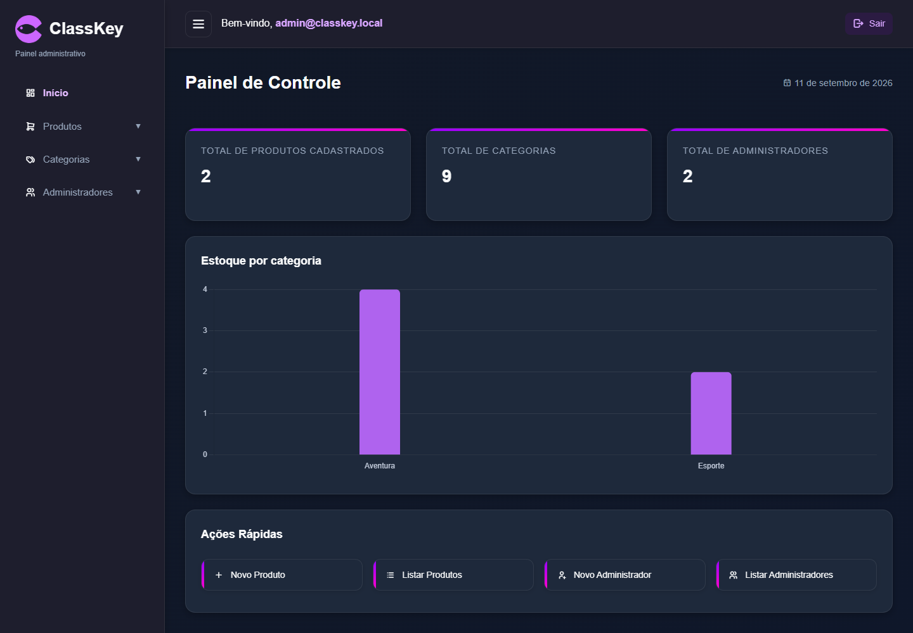

## O projeto

Desenvolvi o ClassKey para o Projeto Integrador do segundo semestre de Tecnologia em Sistemas para Internet (TSI). A proposta foi colocar em prática a construção de uma aplicação web dinâmica: formulários no navegador, requisições em JavaScript, processamento em PHP e persistência em um banco relacional.

O sistema concentra a administração de um catálogo de jogos. O código usa PHP sem frameworks e SQLite, com as páginas organizadas por operação de cadastro, listagem e edição.

| Área | Recursos |
| :--- | :--- |
| Painel | Totais de produtos, categorias e administradores; gráfico do estoque por categoria |
| Produtos | Cadastro com imagem, preço, quantidade e descrição; edição, busca, status e exclusão |
| Categorias | Cadastro, edição, busca, status e exclusão |
| Administradores | Cadastro, listagem, alteração de status e exclusão |
| Acesso | Login com sessão PHP e encerramento da sessão |
| Navegação | Menu recolhível, paginação e tabelas adaptadas para celular |

O escopo é o painel administrativo. Carrinho, pagamento e processamento de vendas não fazem parte desta implementação.

## Telas

Capturas da aplicação executada localmente com PHP e SQLite, com dados do catálogo acadêmico. Os e-mails foram substituídos por identificadores de apresentação em uma cópia do banco. Não há uma versão em produção identificada para este repositório.

### Acesso e catálogo

| Login | Produtos |
| :---: | :---: |
| [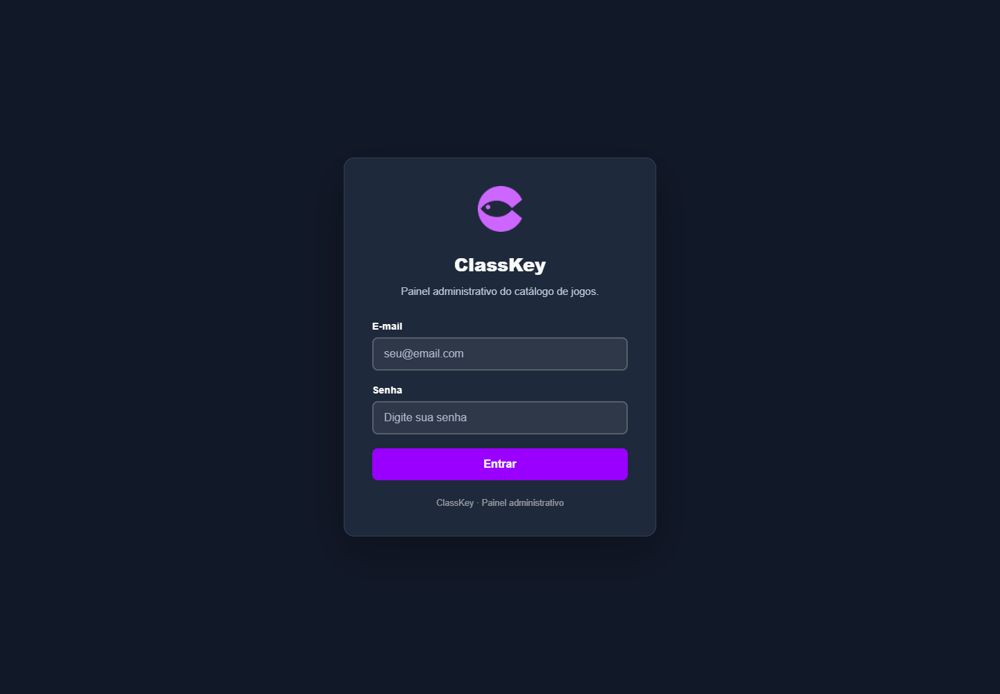](docs/screenshots/login.png) | [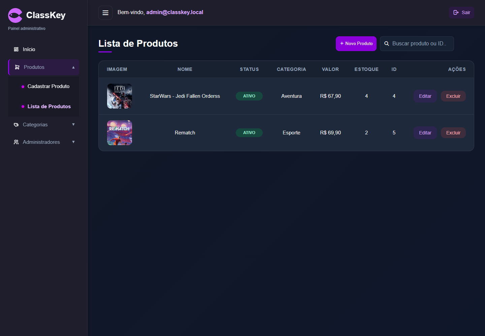](docs/screenshots/produtos.png) |

| Cadastro de produto | Edição de produto |
| :---: | :---: |
| [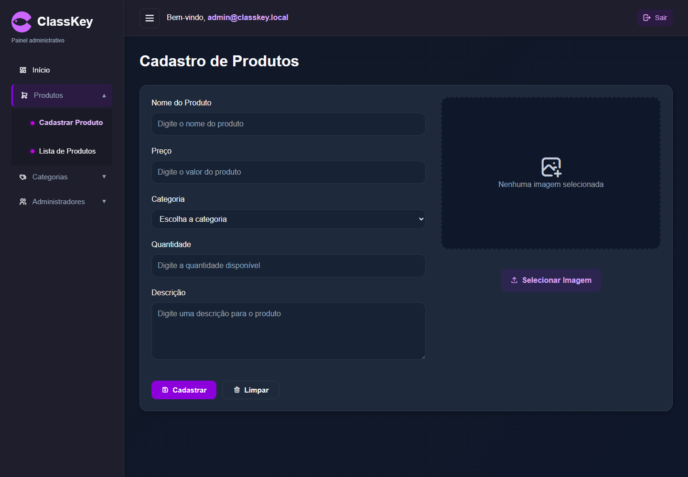](docs/screenshots/cadastro-produto.png) | [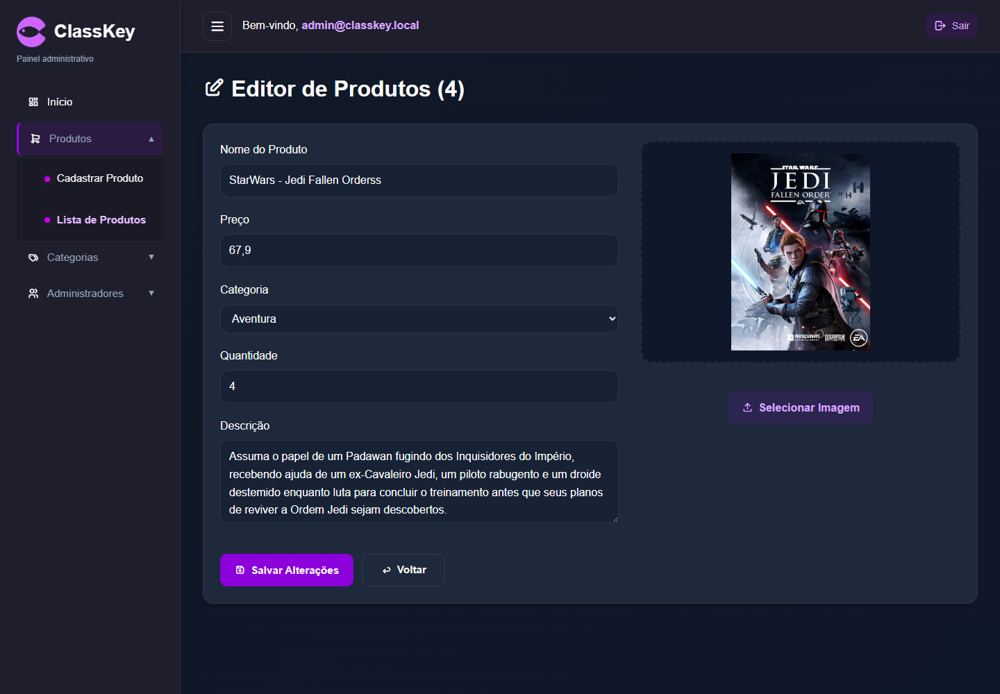](docs/screenshots/edicao-produto.png) |

### Categorias e administradores

| Categorias | Administradores |
| :---: | :---: |
| [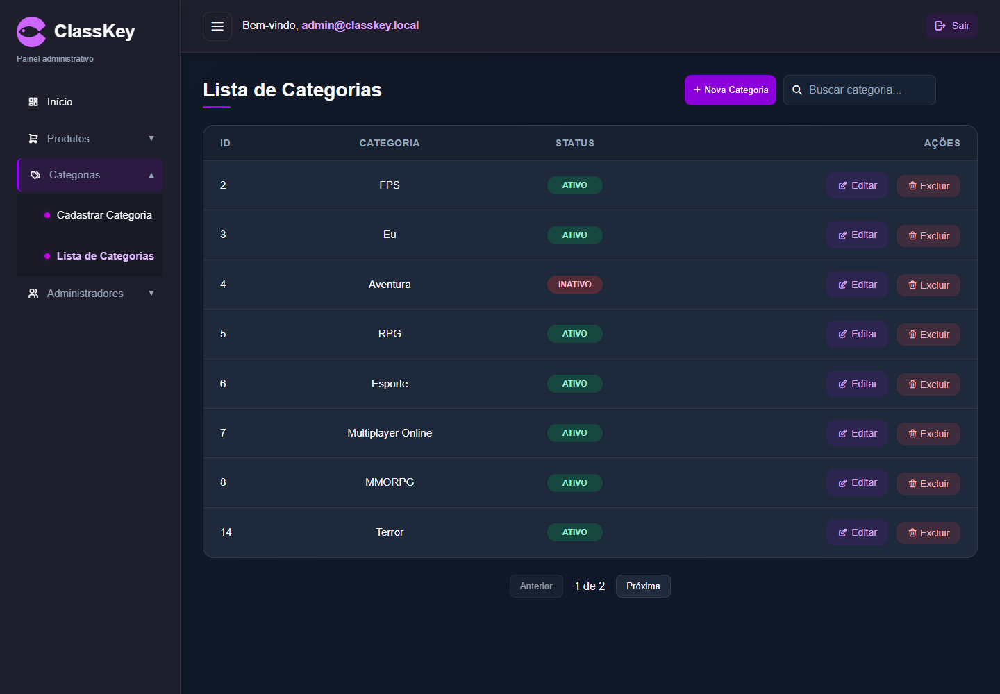](docs/screenshots/categorias.png) | [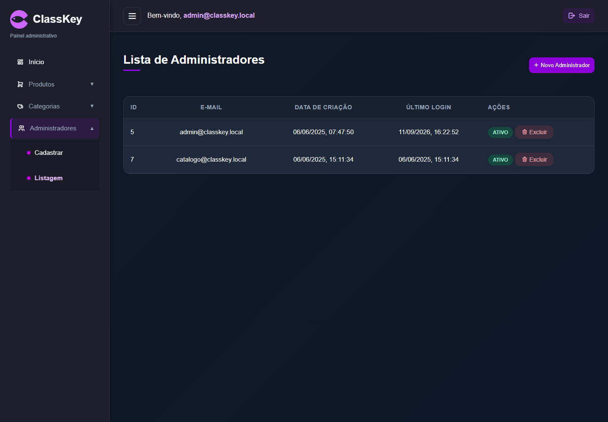](docs/screenshots/administradores.png) |

<details>
<summary>Ver os demais formulários</summary>

**Cadastro de categoria**

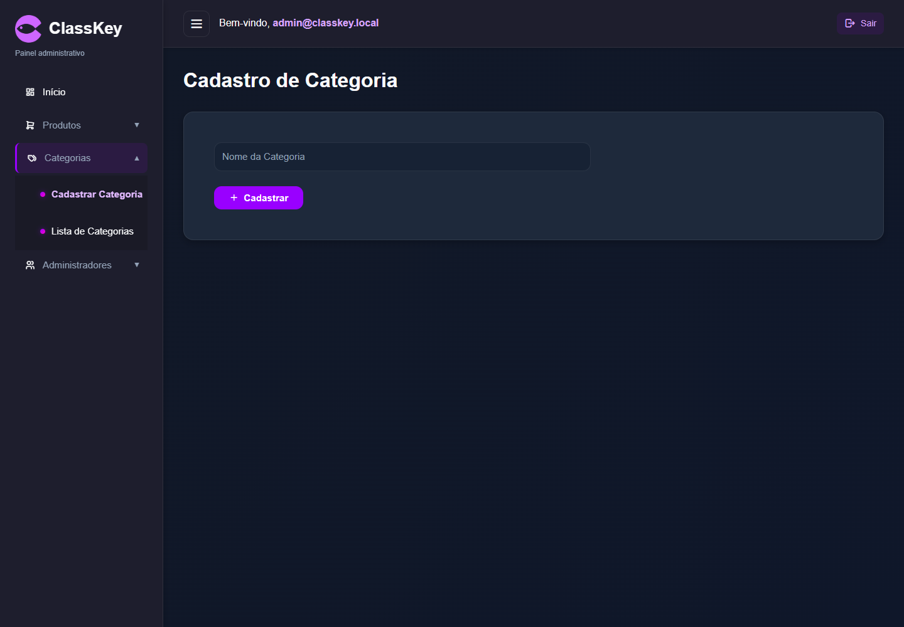

**Edição de categoria**

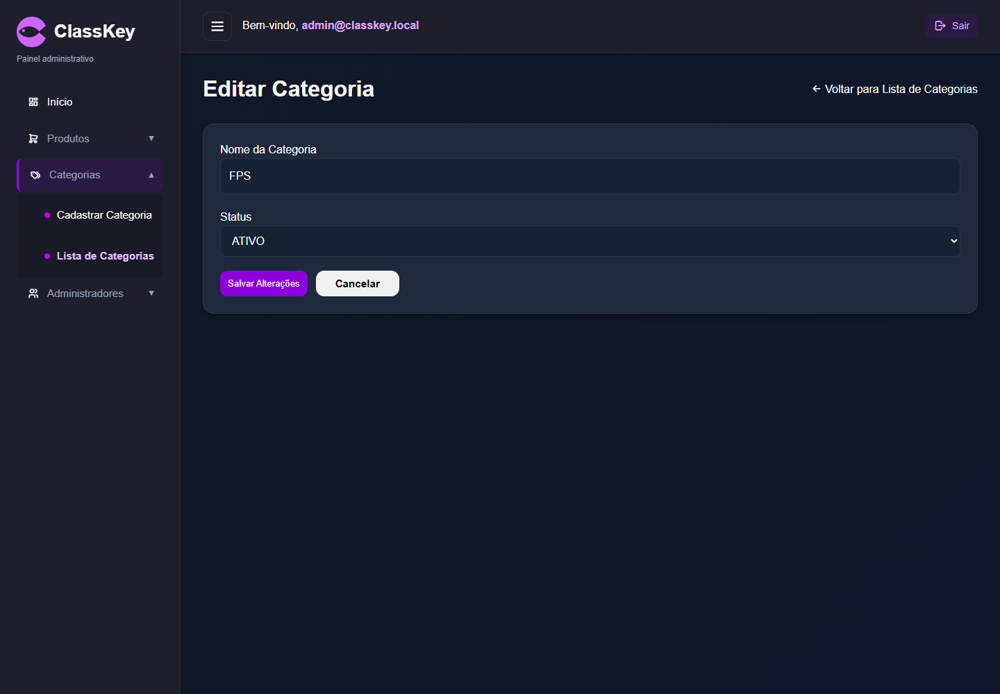

**Cadastro de administrador**

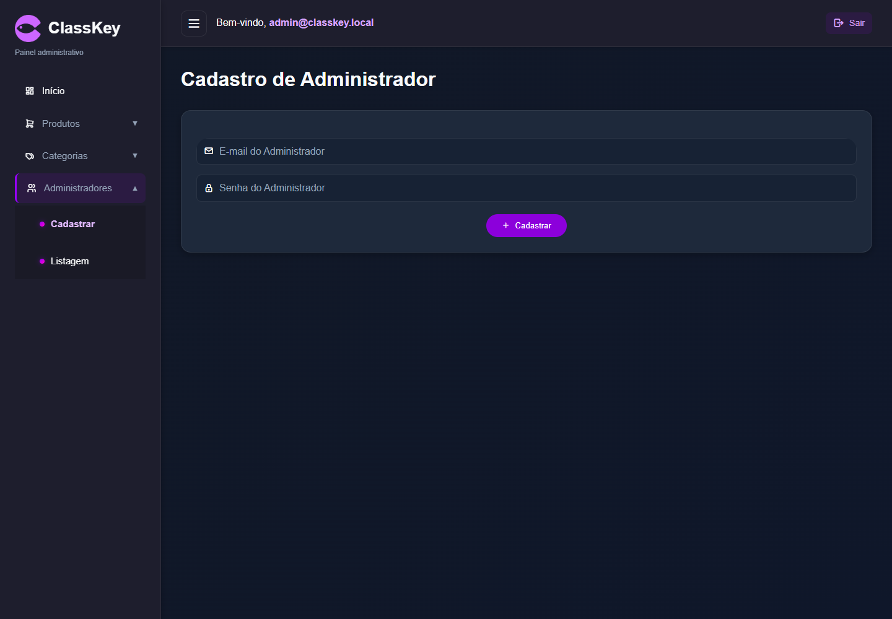

</details>

### No celular

<p align="center">
  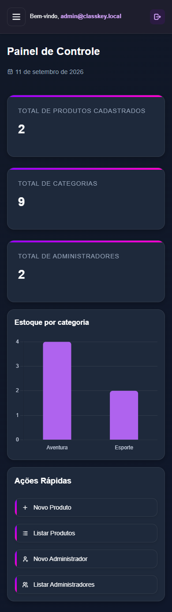
  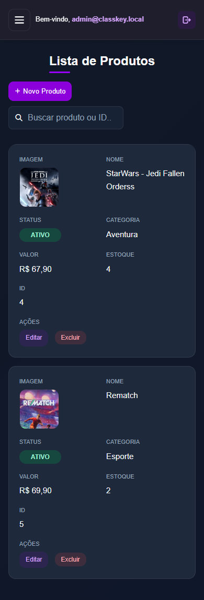
</p>

## Executar localmente

### Requisitos

- PHP 8.x com a extensão `pdo_sqlite` habilitada. A revisão foi validada com PHP 8.4.
- Permissão de escrita em `src/php/db/` e `src/images/` para salvar registros e imagens.
- Um navegador atualizado.

Não é necessário instalar Node.js, Composer ou um servidor MySQL.

### Iniciar

```bash
git clone https://github.com/vitorcgo/classKey-ProjetoIntegrador.git
cd classKey-ProjetoIntegrador
php -S 127.0.0.1:8000
```

Abra [http://127.0.0.1:8000/loginadm.html](http://127.0.0.1:8000/loginadm.html). As páginas precisam ser acessadas pelo servidor PHP; abrir o HTML diretamente ou usar somente o Live Server não executa o backend.

### Primeiro acesso

Se você não possui uma conta, acesse [o cadastro de administrador local](http://127.0.0.1:8000/cadastrodeadm.html), informe seu e-mail e escolha uma senha. Depois, retorne à tela de login e use os dados cadastrados. Não há uma senha padrão documentada.

O arquivo `src/php/db/classkey.db` já acompanha o projeto com os registros acadêmicos originais. Não é necessário importar SQL. Faça uma cópia desse arquivo antes de alterar ou excluir dados que queira preservar.

### Problemas comuns

| Mensagem ou comportamento | O que verificar |
| :--- | :--- |
| `php` não reconhecido | Instale o PHP e adicione sua pasta ao `PATH` |
| `could not find driver` | Habilite `pdo_sqlite` no `php.ini` usado pelo servidor; confira com `php -m` |
| Banco de dados não encontrado | Confirme que `src/php/db/classkey.db` foi mantido na estrutura original |
| Erro ao salvar ou enviar imagem | Confira as permissões de escrita do banco, de sua pasta e de `src/images/` |

## Estrutura

```text
classKey-ProjetoIntegrador/
├── index.html                 # Painel
├── loginadm.html              # Login
├── cadastro*.html             # Formulários de cadastro
├── listade*.html              # Listagens
├── editar*.html               # Formulários de edição
├── docs/screenshots/          # Capturas da aplicação
└── src/
    ├── css/                   # Estilos das páginas e interface compartilhada
    ├── javascript/            # Requisições, navegação e interações
    ├── images/                # Identidade visual e imagens do catálogo
    ├── php/                   # Processamento e consultas com PDO
    │   └── db/                # SQLite, diagrama e SQL acadêmico
    └── vendor/                # Chart.js e Tabler Icons
```

O [diagrama do banco](src/php/db/Diagrama%20Banco%20de%20Dados.png) e o [documento do Projeto Integrador](PROJETO%20INTEGRADOR%20APLICA%C3%87%C3%83O%20WEB%20DIN%C3%82MICA.docx) registram o contexto acadêmico. O arquivo `diagrama.sql` representa uma etapa anterior da modelagem e não recria integralmente o banco usado pela aplicação atual.

## Tecnologias e escopo

O frontend usa HTML, CSS e JavaScript nativo. O backend usa PHP procedural e PDO com SQLite. O gráfico utiliza Chart.js 4.5.1 e os ícones utilizam Tabler Icons 2.37.0; ambos estão incluídos em `src/vendor/`, com suas respectivas licenças. As fontes carregadas pelo Google Fonts possuem alternativas locais do navegador.

Este é um projeto acadêmico para estudo e execução local. Embora o login utilize sessões, a verificação de autenticação ainda não é aplicada uniformemente às rotas. Uma publicação pública exige revisar esse controle e impedir o acesso direto ao arquivo SQLite. O servidor embutido do PHP indicado acima serve ao desenvolvimento local.

---

Desenvolvido por [Vitor](https://github.com/vitorcgo) durante o segundo semestre de TSI.
